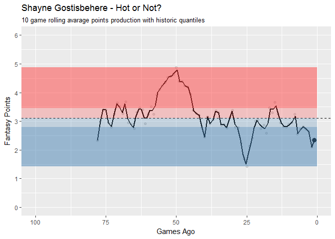

    skater_games <- read_csv("../../data/skater_games.csv")

    ## Parsed with column specification:
    ## cols(
    ##   .default = col_integer(),
    ##   player = col_character(),
    ##   shot_percentage = col_double(),
    ##   minutes_on_ice = col_double(),
    ##   team = col_character(),
    ##   versus = col_character(),
    ##   date = col_date(format = "")
    ## )

    ## See spec(...) for full column specifications.

    player_regex <- "Gostis"

    # calculate rolling averages for player
    player <- skater_games %>%
      add_fantasy_points() %>%
      filter(str_detect(player, player_regex)) %>%
      arrange(date) %>%
      mutate(rolling = rollmean(f_points, 10, fill = NA, align = "right")) %>%
      arrange(desc(date)) %>%
      mutate(i = row_number() * -1)

    # calculate historic quantiles
    stats <- player %>%
      summarise(max = max(rolling, na.rm = T),
                min = min(rolling, na.rm = T),
                mid = median(rolling, na.rm = T),
                q25 = quantile(rolling, .25, na.rm = T),
                q75 = quantile(rolling, .75, na.rm = T))

    # plot
    player %>%
      ggplot(aes(x = i, y = rolling)) +
        geom_point(data = head(player, 1), size = 3) +
        geom_point(alpha = .1) +
        geom_hline(aes(yintercept = stats$mid), linetype = "dashed") +
        coord_cartesian(ylim = c(0, round(stats$max) + 1), xlim = c(-100, 0)) +
        geom_smooth(method = "loess", se = F, span = .05, color = "black") +
        annotate("rect", xmin = -200, xmax = 0, ymin = stats$q25, ymax = stats$mid, alpha = .25, fill = "steelblue") +
        annotate("rect", xmin = -200, xmax = 0, ymin = stats$min, ymax = stats$q25, alpha = .5, fill = "steelblue") +
        annotate("rect", xmin = -200, xmax = 0, ymin = stats$mid, ymax = stats$q75, alpha = .25, fill = "brown1") +
        annotate("rect", xmin = -200, xmax = 0, ymin = stats$q75, ymax = stats$max, alpha = .5, fill = "brown1") +
        scale_x_continuous(labels = abs) +
        scale_y_continuous(breaks = seq(-2, 10, 1)) +
        labs(title = str_c(unique(player$player), " - Hot or Not?"),
             subtitle = "10 game rolling avarage points production with historic quantiles",
             y = "Fantasy Points",
             x = "Games Ago")

    ## Warning: Removed 9 rows containing non-finite values (stat_smooth).

    ## Warning in simpleLoess(y, x, w, span, degree = degree, parametric =
    ## parametric, : span too small. fewer data values than degrees of freedom.

    ## Warning in simpleLoess(y, x, w, span, degree = degree, parametric =
    ## parametric, : pseudoinverse used at -78.385

    ## Warning in simpleLoess(y, x, w, span, degree = degree, parametric =
    ## parametric, : neighborhood radius 2.385

    ## Warning in simpleLoess(y, x, w, span, degree = degree, parametric =
    ## parametric, : reciprocal condition number 0

    ## Warning in simpleLoess(y, x, w, span, degree = degree, parametric =
    ## parametric, : There are other near singularities as well. 5.6882

    ## Warning: Removed 9 rows containing missing values (geom_point).

